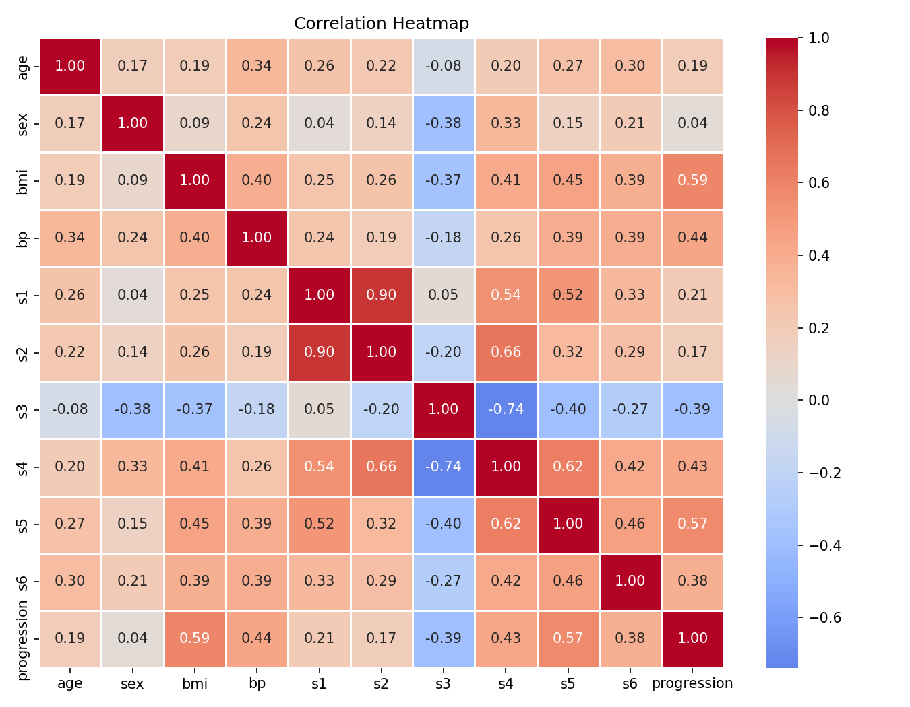
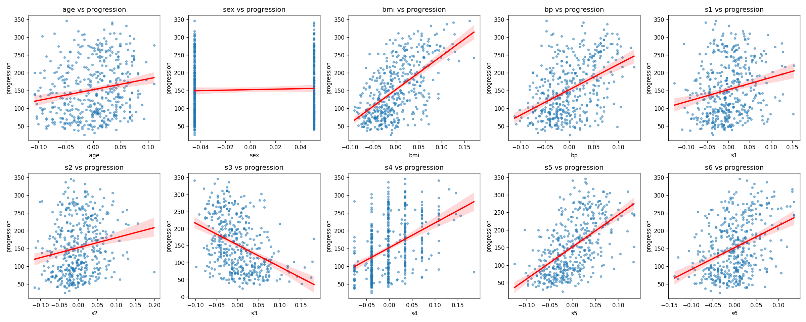

# Practical 1: Association Between Dependent and Independent Variables

## Aim
To identify the association between a dependent variable and a set of independent variables using correlation analysis.

## Dataset
Diabetes dataset (built into scikit-learn, 442 records).
- **Dependent variable:** `progression` (disease progression after one year)
- **Independent variables:** `age`, `sex`, `bmi`, `bp`, `s1` to `s6` (blood serum measurements)

## Theory
- **Association** shows whether two variables change together.
- **Pearson correlation coefficient (r)** ranges from -1 to +1:
  `r = Σ(xᵢ − x̄)(yᵢ − ȳ) / √[Σ(xᵢ − x̄)² · Σ(yᵢ − ȳ)²]`
  - r > 0: positive association, r < 0: negative association, r ≈ 0: no linear association.
  - |r| ≥ 0.7 strong, 0.4 to 0.7 moderate, 0.2 to 0.4 weak, below 0.2 very weak.
- **R²** is the fraction of variation in y explained by x.
- **p-value < 0.05** means the association is statistically significant.
- Correlation does not imply causation.

## Steps
1. Load the dataset.
2. Check shape, missing values and summary statistics.
3. Define the dependent and independent variables.
4. Compute the correlation matrix.
5. Plot a heatmap and scatter plots with fitted lines.
6. Calculate r, R² and p-value for each variable and classify its strength.
7. State the conclusion.

## How to run
```bash
pip install -r requirements.txt
python association_analysis.py
```

## Output

### Correlation heatmap


### Scatter plots (each variable vs progression)


### Association summary
| Variable | r | Direction | Strength | Significant (p<0.05) |
|---|---|---|---|---|
| bmi | 0.586 | Positive | Moderate | Yes |
| s5 | 0.566 | Positive | Moderate | Yes |
| bp | 0.441 | Positive | Moderate | Yes |
| s4 | 0.430 | Positive | Moderate | Yes |
| s3 | -0.395 | Negative | Weak | Yes |
| s6 | 0.382 | Positive | Weak | Yes |
| s1 | 0.212 | Positive | Weak | Yes |
| age | 0.188 | Positive | Very weak | Yes |
| s2 | 0.174 | Positive | Very weak | Yes |
| sex | 0.043 | Positive | Very weak | No |

The full console output is in [output.txt](output.txt).

## Conclusion
BMI has the strongest association with disease progression (r = 0.586), followed by s5 and blood pressure. s3 is the only variable with a negative association. Sex shows almost no association (p = 0.37, not significant). No variable is strongly associated (|r| ≥ 0.7), so no single variable explains the outcome on its own.
