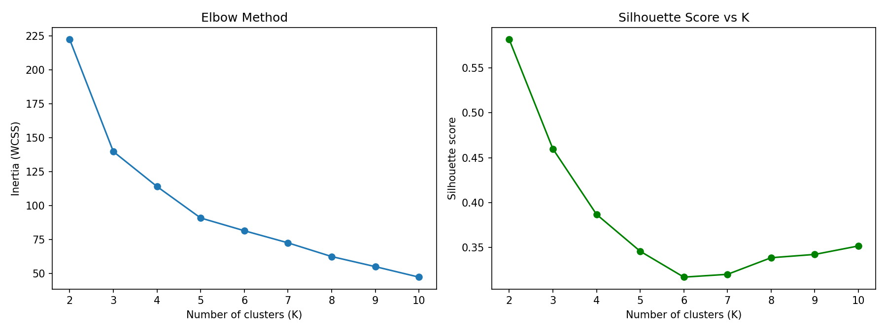
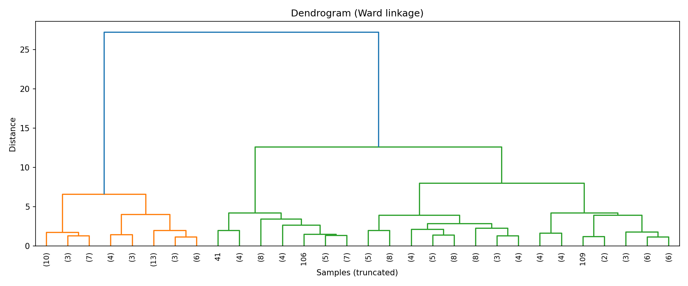
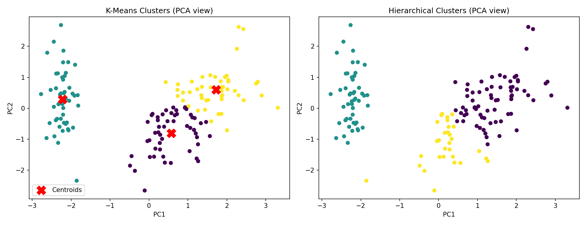

# Practical 2: Clustering Using Unsupervised Learning

## Aim
To apply clustering techniques (K-Means and Hierarchical clustering) to group data without using labels.

## Dataset
Iris dataset (built into scikit-learn, 150 samples, 4 features: sepal length, sepal width, petal length, petal width).
The species labels are **not** used for training. They are used only at the end to check the result.

## Theory
- **Unsupervised learning** finds patterns in data that has no labels.
- **Clustering** groups similar data points together so that points in the same cluster are close and points in different clusters are far apart.
- **K-Means:** choose K, place K centroids, assign each point to its nearest centroid, move each centroid to the mean of its points, and repeat until nothing changes. It minimises the inertia (WCSS), the sum of squared distances from points to their centroid.
- **Elbow method:** plot inertia against K and choose the K where the curve bends like an elbow.
- **Silhouette score** ranges from -1 to +1. Higher means points fit their own cluster well and are far from other clusters.
- **Hierarchical (agglomerative) clustering:** start with every point as its own cluster and repeatedly merge the two closest clusters. The **dendrogram** shows the merges, and cutting it at a height gives the clusters. Ward linkage merges the pair that increases variance the least.
- **Adjusted Rand Index (ARI)** compares clusters with the true labels (1 = perfect, 0 = random).
- Features are scaled with `StandardScaler` because clustering depends on distance.

## Steps
1. Load the dataset and drop the labels.
2. Scale the features.
3. Run K-Means for K = 2 to 10 and plot the elbow curve and silhouette scores.
4. Fit the final K-Means model with K = 3.
5. Build the dendrogram and fit hierarchical clustering with K = 3.
6. Plot the clusters in 2D using PCA.
7. Compare with the true species using ARI and a cross-table.
8. State the conclusion.

## How to run
```bash
pip install -r requirements.txt
python clustering_analysis.py
```

## Output

### Elbow method and silhouette score


### Dendrogram


### Clusters (PCA view)


### Results
| Method | Cluster sizes | Silhouette score | ARI vs true species |
|---|---|---|---|
| K-Means (K=3) | 53, 50, 47 | 0.4599 | 0.6201 |
| Hierarchical (K=3) | 71, 49, 30 | 0.4467 | 0.6153 |

The full console output is in [output.txt](output.txt).

## Conclusion
The elbow curve bends at K = 3, so 3 clusters were used. (The silhouette score is highest at K = 2, because two of the iris species overlap.) K-Means and hierarchical clustering gave similar results, and one cluster matched the setosa species perfectly, while the other two partly overlap. Both methods found the groups without using any labels.
