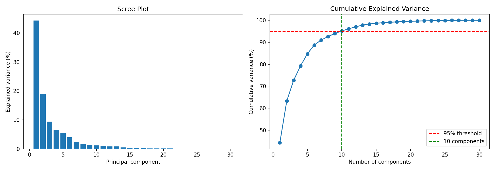
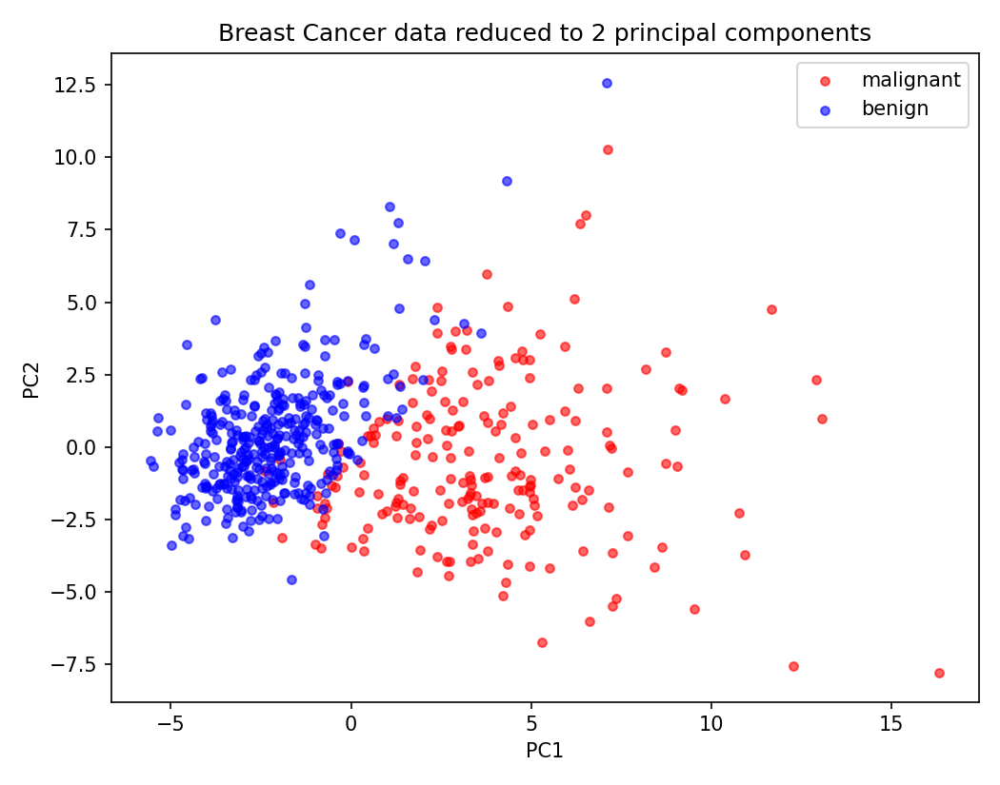

# Practical 3: Dimensionality Reduction Using PCA

## Aim
To apply Principal Component Analysis (PCA) to reduce the number of features while keeping most of the information.

## Dataset
Breast Cancer Wisconsin dataset (built into scikit-learn): 569 samples, 30 numeric features, 2 classes (212 malignant, 357 benign).

## Theory
- **Dimensionality reduction** reduces the number of features in a dataset. It makes data easier to visualise, speeds up models, and removes redundant (highly correlated) features.
- **PCA** transforms the original features into new uncorrelated features called **principal components (PCs)**. Each PC is a linear combination of the original features.
  - PC1 points in the direction of maximum variance in the data, PC2 in the direction of the next highest variance perpendicular to PC1, and so on.
- **Steps of PCA:**
  1. Standardize the data (mean 0, standard deviation 1).
  2. Compute the covariance matrix.
  3. Find its eigenvalues and eigenvectors.
  4. Sort the eigenvectors by eigenvalue, largest first.
  5. Keep the top k eigenvectors and project the data onto them.
- **Explained variance ratio** = eigenvalue of a PC / sum of all eigenvalues. It shows how much information each PC carries.
- **Scree plot** shows the variance of each PC. **Cumulative variance** helps choose k (commonly 90% to 95%).
- PCA is unsupervised (it does not use the labels) and is sensitive to scale, so standardizing is essential.

## Steps
1. Load the dataset.
2. Standardize the features.
3. Fit PCA with all components and calculate the explained variance.
4. Plot the scree plot and cumulative variance, and choose the number of components for 95% variance.
5. Reduce to 2 components and plot the data.
6. Check which original features contribute most to PC1.
7. Compare a Logistic Regression classifier before and after PCA.
8. State the conclusion.

## How to run
```bash
pip install -r requirements.txt
python pca_analysis.py
```

## Output

### Scree plot and cumulative variance


### Data in 2 principal components


### Results
| Measure | Value |
|---|---|
| Original features | 30 |
| Components for 90% variance | 7 |
| Components for 95% variance | 10 |
| Variance kept by 2 components | 63.24% |
| Accuracy with all 30 features | 98.25% |
| Accuracy with 10 PCA components | 97.37% |

The full console output is in [output.txt](output.txt).

## Conclusion
10 principal components keep 95% of the information of all 30 features, reducing the data by 67% with only a small drop in accuracy (98.25% to 97.37%). Two components keep 63.24% of the variance and already separate malignant and benign cases fairly well in the 2D plot.
