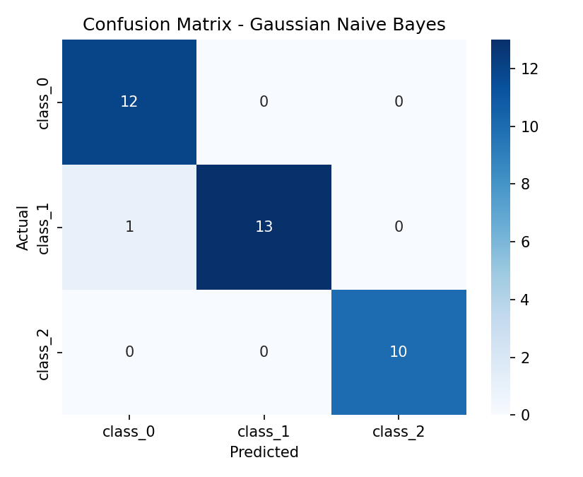

# Practical 4: Naive Bayes Classification

## Aim
To apply Naive Bayes classification algorithms: Gaussian Naive Bayes on numeric data and Multinomial Naive Bayes on text.

## Dataset
- **Part A:** Wine dataset (built into scikit-learn): 178 samples, 13 features, 3 classes.
- **Part B:** A small hand-made sample of 16 messages labelled spam or not spam, to show text classification.

## Theory
- **Naive Bayes** is a probabilistic classifier based on **Bayes' theorem**:

  `P(class | features) = P(features | class) × P(class) / P(features)`

- It is called **naive** because it assumes all features are independent of each other given the class. The likelihood becomes a product:

  `P(x₁, x₂, ..., xₙ | class) = P(x₁ | class) × P(x₂ | class) × ... × P(xₙ | class)`

- The class with the highest posterior probability is predicted.
- **Gaussian Naive Bayes:** for continuous features. It assumes each feature follows a normal distribution within each class, using the mean and variance of the training data.
- **Multinomial Naive Bayes:** for count data such as word counts in text. It is widely used for spam filtering and document classification.
- **Advantages:** fast, simple, works well with small datasets and many features.
- **Limitation:** the independence assumption is rarely true in real data.
- **Evaluation:** accuracy, confusion matrix, precision, recall, F1-score and cross-validation.

## Steps
1. Load the dataset.
2. Split into 80% training and 20% testing data.
3. Train `GaussianNB` on the training data.
4. Predict on the test set and calculate accuracy, confusion matrix and classification report.
5. Run 5-fold cross-validation.
6. Plot the confusion matrix and show class probabilities for one sample.
7. Part B: convert messages to word counts with `CountVectorizer`, train `MultinomialNB`, and predict new messages.
8. State the conclusion.

## How to run
```bash
pip install -r requirements.txt
python naive_bayes_classification.py
```

## Output

### Confusion matrix (Part A)


### Results (Part A)
| Measure | Value |
|---|---|
| Test accuracy | 97.22% |
| Mean 5-fold cross-validation accuracy | 96.63% |
| Macro average F1-score | 0.97 |

### Spam filter demo (Part B)
| Message | Prediction | P(spam) |
|---|---|---|
| free prize click now | SPAM | 0.994 |
| project report due tomorrow | NOT SPAM | 0.045 |
| win cash offer today | SPAM | 0.953 |

The full console output is in [output.txt](output.txt).

## Conclusion
Gaussian Naive Bayes classified the Wine data with 97.22% test accuracy (mean 5-fold cross-validation 96.63%), with only 1 of 36 test samples misclassified. Multinomial Naive Bayes separated spam from normal messages correctly in the text demo. Part B uses a very small sample, so it only illustrates the method and is not an accuracy measurement.
