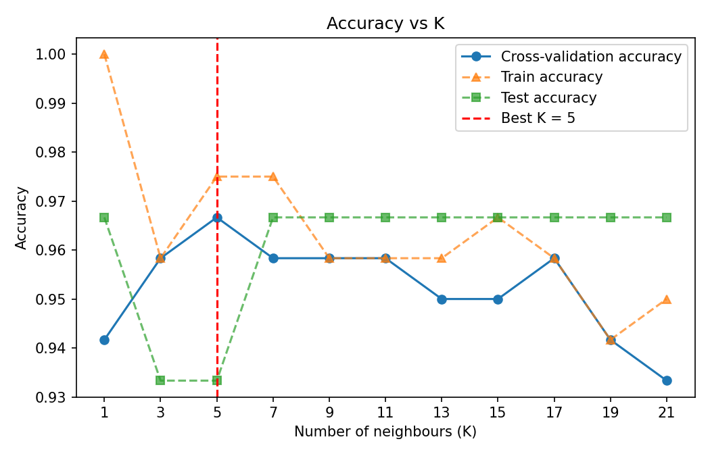
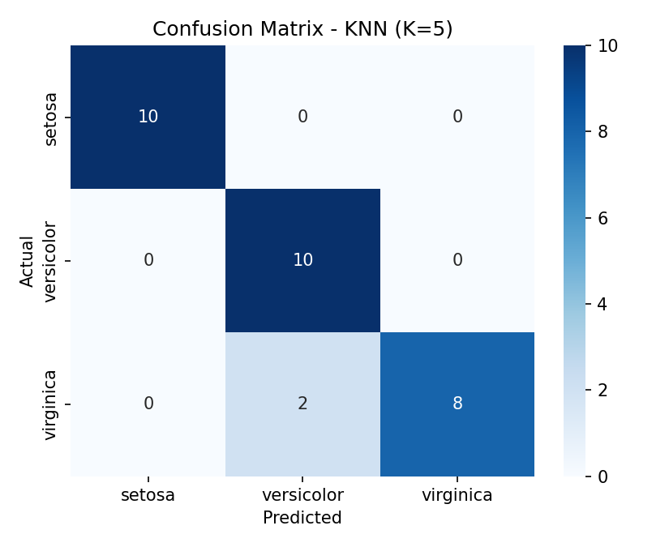
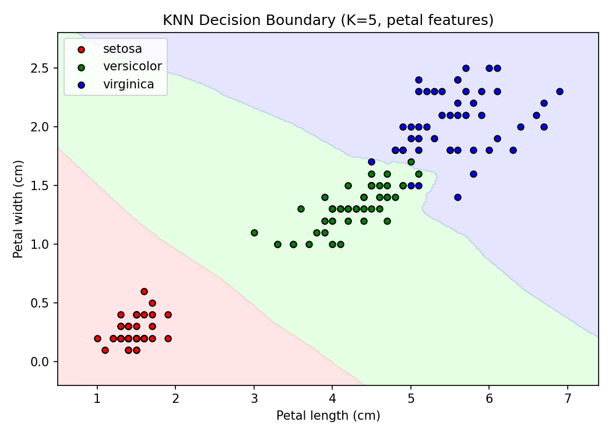

# Practical 5: KNN Algorithm for Classification

## Aim
To apply the K-Nearest Neighbours (KNN) algorithm for classification.

## Dataset
Iris dataset (built into scikit-learn): 150 samples, 4 features (sepal length, sepal width, petal length, petal width), 3 classes (setosa, versicolor, virginica).

## Theory
- **KNN** is a supervised learning algorithm used for classification and regression. It is a **lazy learner**: it does not build a model during training, it just stores the training data.
- **How it classifies a new point:**
  1. Calculate the distance from the new point to every training point.
  2. Select the K nearest points.
  3. Take a majority vote of their classes. The winning class is the prediction.
- **Distance measure:** commonly Euclidean distance, `d = √[(x₁ − y₁)² + (x₂ − y₂)² + ... + (xₙ − yₙ)²]`.
- **Choosing K:**
  - A very small K (e.g. 1) is sensitive to noise and can overfit.
  - A very large K smooths too much and can underfit.
  - An odd K avoids ties. K is usually chosen by cross-validation.
- **Feature scaling is essential**, because KNN depends on distance and large-valued features would dominate.
- **Advantages:** simple, no training time, works well on small datasets.
- **Disadvantages:** slow on large datasets, sensitive to scale and irrelevant features.
- **Evaluation:** accuracy, confusion matrix, precision, recall and F1-score.

## Steps
1. Load the dataset.
2. Split into 80% training and 20% testing data.
3. Scale the features with `StandardScaler`.
4. Try odd K values from 1 to 21 using 5-fold cross-validation on the training data, and choose the best K.
5. Train the final `KNeighborsClassifier` and evaluate on the test set.
6. Predict a new unseen sample.
7. Plot the decision boundary using two features.
8. State the conclusion.

## How to run
```bash
pip install -r requirements.txt
python knn_classification.py
```

## Output

### Accuracy vs K


### Confusion matrix


### Decision boundary (petal length and width)


### Results
| Measure | Value |
|---|---|
| Best K (by cross-validation) | 5 |
| Cross-validation accuracy at K=5 | 96.67% |
| Test accuracy | 93.33% |
| Misclassified test samples | 2 out of 30 (both virginica predicted as versicolor) |

New sample [5.9, 3.0, 5.1, 1.8] was predicted as **virginica** (P = 0.6, versicolor P = 0.4).

The full console output is in [output.txt](output.txt).

## Conclusion
KNN with K = 5 (chosen by cross-validation) classified the Iris test data with 93.33% accuracy. Setosa was classified perfectly, and the only errors were 2 virginica flowers predicted as versicolor, because those two species overlap. K was chosen using the training data only, so the test accuracy is an honest estimate. With a test set of only 30 samples, one extra mistake changes accuracy by about 3%.
