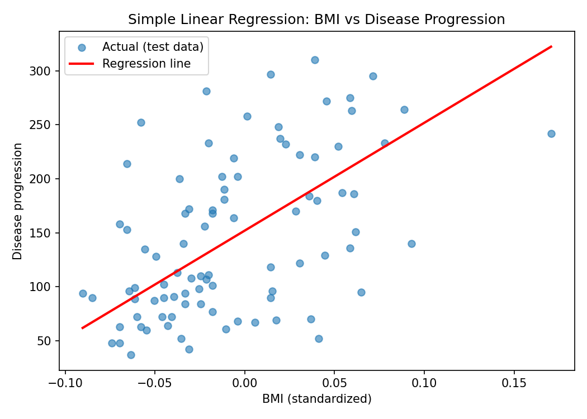
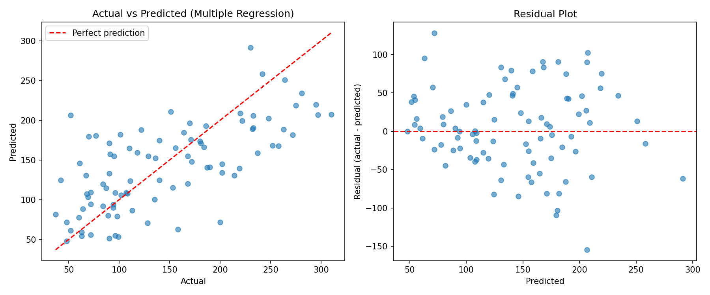

# Practical 6: Linear Regression Algorithm

## Aim
To implement the Linear Regression algorithm (simple and multiple) and evaluate it.

## Dataset
Diabetes dataset (built into scikit-learn): 442 samples, 10 features (age, sex, bmi, bp, s1 to s6).
- **Target:** `progression` (disease progression after one year).
- The features in this dataset are already scaled (mean-centered), so the coefficients are large numbers.

## Theory
- **Linear regression** is a supervised learning algorithm that predicts a continuous value by fitting a straight line (or a plane) to the data.
- **Simple linear regression** (one feature): `y = b₀ + b₁x`
- **Multiple linear regression** (many features): `y = b₀ + b₁x₁ + b₂x₂ + ... + bₙxₙ`
  - `b₀` is the intercept and `b₁...bₙ` are the coefficients (slopes).
- **Least squares method:** the coefficients are chosen to minimise the sum of squared errors between actual and predicted values. The solution is given by the **normal equation**: `w = (XᵀX)⁻¹ Xᵀy`.
- **Evaluation metrics:**
  - **MAE** = average of |actual − predicted|
  - **MSE** = average of (actual − predicted)²
  - **RMSE** = √MSE (in the same units as the target)
  - **R² score** = fraction of the variation in y explained by the model (1 = perfect, 0 = no better than predicting the mean)
- **Residuals** = actual − predicted. A good model has residuals scattered randomly around zero.
- **Assumptions:** linear relationship, independent errors, constant variance of errors, and little multicollinearity between features.

## Steps
1. Load the dataset and check for missing values.
2. Split into 80% training and 20% testing data.
3. Part A: train simple linear regression on `bmi` and plot the regression line.
4. Part B: train multiple linear regression on all features, then plot actual vs predicted and the residuals.
5. Evaluate both with MAE, MSE, RMSE and R².
6. Part C: implement the same line from scratch with the normal equation and check it matches scikit-learn.
7. Compare the models and state the conclusion.

## How to run
```bash
pip install -r requirements.txt
python linear_regression.py
```

## Output

### Simple linear regression line


### Multiple regression: actual vs predicted and residuals


### Results
Equation (simple model): `progression = 152.00 + 998.58 × bmi`

| Model | MAE | RMSE | R² (test) |
|---|---|---|---|
| Simple (bmi only) | 52.26 | 63.73 | 0.2334 |
| Multiple (10 features) | 42.79 | 53.85 | 0.4526 |

The scratch implementation (normal equation) gave exactly the same intercept and slope as scikit-learn.

The full console output is in [output.txt](output.txt).

## Conclusion
The multiple regression model (R² = 0.45) explains more of the variation in disease progression than the simple model using BMI alone (R² = 0.23), and its errors are smaller (RMSE 53.85 vs 63.73). However, about half of the variation is still unexplained, so a linear model has limits on this data. Some coefficients (such as s1 and s2) are large with opposite signs because those features are strongly correlated with each other (multicollinearity), so individual coefficients should not be over-interpreted.
