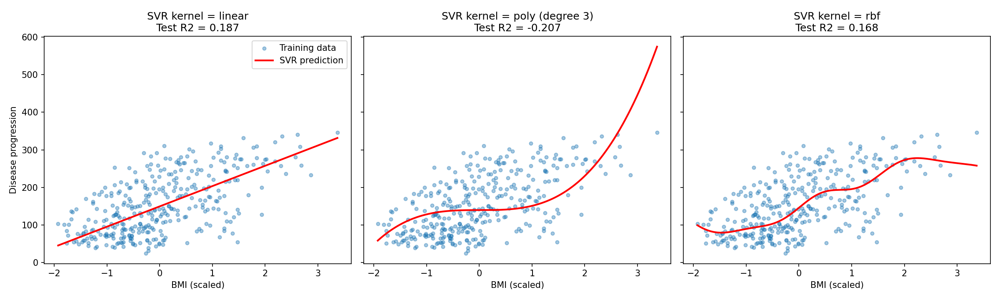
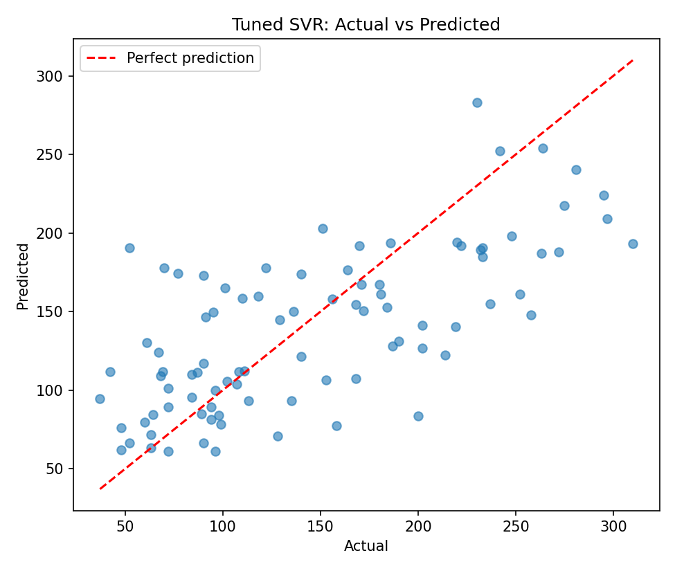

# Practical 7: SVM Algorithm for Regression (SVR)

## Aim
To implement the Support Vector Machine algorithm for regression (SVR) and study the effect of kernels and hyper-parameters.

## Dataset
Diabetes dataset (built into scikit-learn): 442 samples, 10 features. Target: `progression` (disease progression after one year).

## Theory
- **Support Vector Regression (SVR)** is the regression version of SVM. Instead of separating classes, it fits a function that stays within a margin of tolerance around the data.
- **ε-insensitive tube:** errors smaller than **epsilon (ε)** are ignored. Only points outside the tube affect the model. The points on or outside the tube boundary are the **support vectors**, and they alone define the fitted function.
- **Objective:** keep the function as flat as possible while allowing some points outside the tube, with a penalty for those points.
- **Hyper-parameters:**
  - **C:** penalty for points outside the tube. Large C fits the training data closely (risk of overfitting), small C gives a smoother model.
  - **epsilon (ε):** width of the tube. A larger ε ignores more small errors and gives fewer support vectors.
  - **gamma:** how far one sample's influence reaches in the RBF kernel. A large gamma gives a wiggly fit.
- **Kernels** let SVR model non-linear relationships without explicitly adding features:
  - **linear:** `K(x, z) = x · z`
  - **polynomial:** `K(x, z) = (x · z + c)^d`
  - **RBF:** `K(x, z) = exp(−γ ‖x − z‖²)`
- **Scaling:** SVR depends on distances, so both X and y should be standardized.
- **Evaluation metrics:** MAE, RMSE and R².
- **Tuning:** GridSearchCV tries many parameter combinations using cross-validation on the training data.

## Steps
1. Load the dataset and split into 80% training and 20% testing data.
2. Scale X and y.
3. Part A: train SVR with linear, polynomial and RBF kernels on one feature (BMI) and plot the fits.
4. Part B: tune kernel, C, epsilon and gamma on all features with `GridSearchCV` (5-fold).
5. Compare Linear Regression, default SVR and tuned SVR on the test set.
6. Plot actual vs predicted values and state the conclusion.

## How to run
```bash
pip install -r requirements.txt
python svr_regression.py
```

## Output

### SVR with different kernels (BMI only)


### Tuned SVR: actual vs predicted


### Results
**Part A (BMI only):**

| Kernel | MAE | RMSE | R² |
|---|---|---|---|
| linear | 52.50 | 65.61 | 0.1874 |
| poly (degree 3) | 61.18 | 79.97 | -0.2070 |
| rbf | 51.30 | 66.38 | 0.1684 |

**Part B (all features):** best parameters `C=1, epsilon=0.1, gamma=0.01, kernel=rbf`

| Model | MAE | RMSE | R² (test) |
|---|---|---|---|
| Linear Regression | 42.79 | 53.85 | 0.4526 |
| SVR (default settings) | 38.92 | 50.27 | 0.5231 |
| SVR (tuned) | 41.87 | 52.65 | 0.4768 |

Cross-validation R² on the training data: tuned SVR 0.4568, default SVR 0.3883.

The full console output is in [output.txt](output.txt).

## Conclusion
Tuning improved SVR in cross-validation (R² 0.39 to 0.46), and the tuned SVR (test R² 0.48) did better than Linear Regression (test R² 0.45). The default SVR happened to score higher on this particular test split (0.52), but with only 89 test samples that gap is within noise, so the cross-validated tuned model is the more reliable choice. On one feature (BMI) the polynomial kernel fitted poorly (negative R²), which shows that a more flexible kernel is not automatically better.
