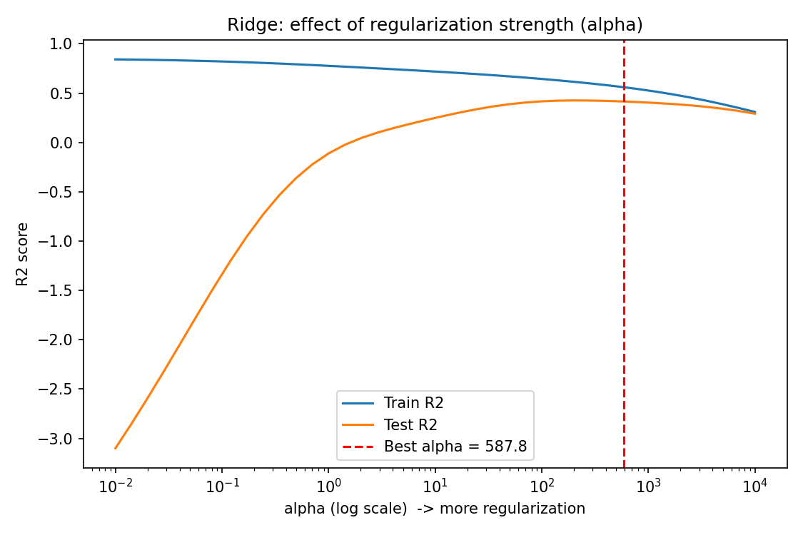
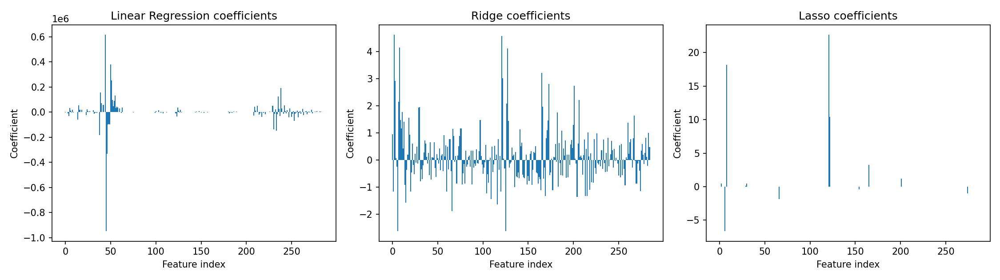

# Practical 8: Regularization to Avoid Overfitting

## Aim
To show how overfitting occurs in a regression model and how regularization (Ridge, Lasso, ElasticNet) reduces it.

## Dataset
Diabetes dataset (built into scikit-learn): 442 samples, 10 features. Target: `progression`.

To create an overfitting situation, the 10 features are expanded with **polynomial features of degree 3**, giving **285 features for only 353 training samples**. A model with this many features can memorise the training data.

## Theory
- **Overfitting:** the model fits the training data very well (including its noise) but performs badly on new data. Signs: high training score, low test score.
- **Underfitting:** the model is too simple to capture the pattern, so both scores are low.
- **Regularization** adds a penalty on the size of the coefficients to the loss function, which forces the model to stay simpler.
- **Ridge regression (L2):** Loss = Σ(y − ŷ)² + α Σ wⱼ²
  - Shrinks all coefficients towards zero but rarely makes them exactly zero.
- **Lasso regression (L1):** Loss = Σ(y − ŷ)² + α Σ |wⱼ|
  - Can shrink some coefficients exactly to zero, so it also performs **feature selection**.
- **ElasticNet:** a mix of L1 and L2 penalties, controlled by `l1_ratio`.
- **alpha (α):** the regularization strength. α = 0 gives plain linear regression. A larger α gives simpler models, and too large an α causes underfitting. It is chosen by cross-validation.
- Features must be scaled before regularization, because the penalty depends on coefficient size.
- **Other ways to reduce overfitting:** more training data, fewer features, cross-validation, early stopping, dropout (neural networks).

## Steps
1. Load the dataset and split into 80% training and 20% testing data.
2. Create degree-3 polynomial features (285 features) and scale them.
3. Fit plain Linear Regression and show the overfitting (big gap between train and test R²).
4. Choose alpha using cross-validation on the training data (`RidgeCV`, `LassoCV`).
5. Fit Ridge, Lasso and ElasticNet and compare the models.
6. Plot the effect of alpha and the size of the coefficients.
7. State the conclusion.

## How to run
```bash
pip install -r requirements.txt
python regularization.py
```

## Output

### Ridge: effect of alpha on train and test R²


### Coefficients of the three models


### Results
| Model | Train R² | Test R² | Gap | Test RMSE | Non-zero coefficients |
|---|---|---|---|---|---|
| Linear Regression | 0.8773 | -14.5613 | 15.44 | 287.13 | 285 |
| Ridge (L2), alpha = 587.8 | 0.5598 | 0.4152 | 0.14 | 55.66 | 285 |
| Lasso (L1), alpha = 5.97 | 0.5013 | 0.4770 | 0.02 | 52.64 | 12 |
| ElasticNet | 0.4704 | 0.4146 | 0.06 | 55.69 | 110 |

Largest coefficient: Linear Regression 949,317 | Ridge 4.6 | Lasso 22.7.
ElasticNet used the Lasso alpha with `l1_ratio = 0.5` and was not tuned separately.

The full console output is in [output.txt](output.txt).

## Conclusion
Plain Linear Regression badly overfit: train R² was 0.88 but test R² was -14.56, with coefficients as large as 949,317. Regularization fixed this. Ridge shrank all coefficients and brought the test R² to 0.42, while Lasso gave the best test R² (0.48) with the smallest train-test gap, and kept only 12 of the 285 features. This shows that regularization trades a little training accuracy for much better performance on unseen data.
