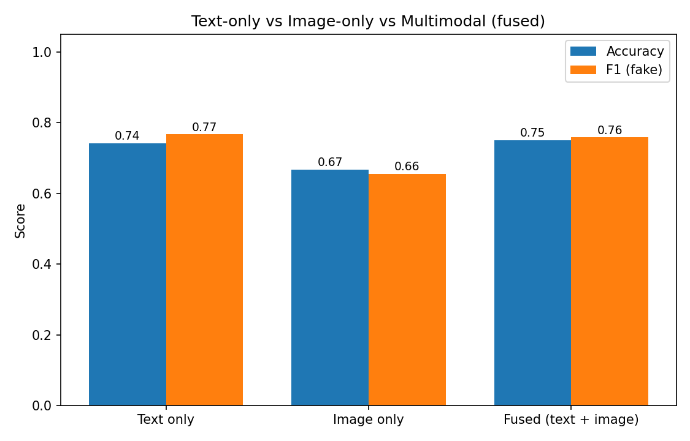
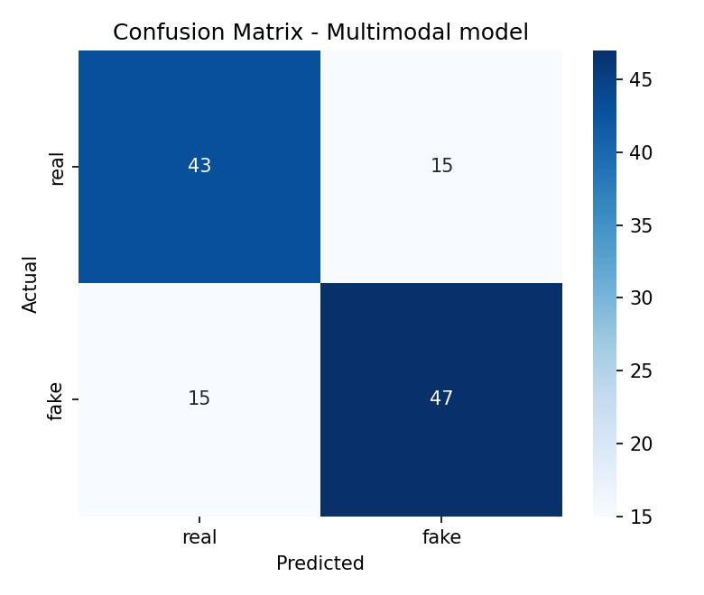

# Practical 10: Fake News Detection from Multimodal Data

## Aim
To design a model that detects fake news using **multimodal data**, that is, text and images together, and to check whether combining both gives a better result than using either one alone.

## Data
- **Demo mode (default):** a small **synthetic** dataset of 600 posts (text + image) created by the script, so the code runs without any download. In it, text and image each carry only a partial, noisy signal about the label. **Results in demo mode only show how the pipeline works. They are not real fake news results.**
- **Real data mode:** pass a CSV with the columns `text`, `image` (file name) and `label` (0 = real, 1 = fake), plus the folder of images:
  `python fake_news_multimodal.py --csv data.csv --img_dir images/`
  A suitable public multimodal dataset is Fakeddit (Reddit posts with images and labels). Use a small subset (a few thousand posts) for a practical.

## Theory
- **Fake news** is false or misleading information presented as news. Detecting it is a binary classification problem (real vs fake).
- **Unimodal vs multimodal:**
  - A *unimodal* model uses one data type (only text or only image).
  - A *multimodal* model uses several (text + image), because fake posts often have a sensational headline and a misleading or unrelated picture. Each modality can catch things the other misses.
- **Text features, TF-IDF:** converts text to numbers. A word gets a high score if it is frequent in a post but rare across all posts. (Advanced alternative: BERT embeddings.)
- **Image features:** the demo uses simple colour statistics (mean, standard deviation and histogram of each RGB channel). With `--deep`, a ResNet18 pretrained on ImageNet gives 512 numbers per image (transfer learning).
- **Fusion, combining the modalities:**
  - **Early fusion** (used here): join the text and image feature vectors into one vector and train one classifier on it.
  - **Late fusion:** train separate models and combine their predictions (average or vote).
- **Classifier:** Logistic Regression, which is simple, fast and works well on high-dimensional TF-IDF features.
- **Evaluation:** accuracy, precision, recall, F1-score and the confusion matrix. For fake news, the F1-score of the *fake* class is important.
- **Fair comparison:** text-only, image-only and fused models use the same train/test split, and the vectorizer and scaler are fitted on training data only to avoid data leakage.
- **Challenges:** subtle fakes, out-of-context real images, sarcasm, and models learning dataset quirks rather than truth.

## Steps
1. Load the dataset (text, image, label).
2. Clean the text: lower-case, remove links and symbols.
3. Split into 80% training and 20% testing data.
4. Extract text features with TF-IDF.
5. Extract image features (colour statistics, or ResNet18 with `--deep`) and scale them.
6. Train three Logistic Regression models: text only, image only, and fused (text + image).
7. Evaluate with accuracy, F1, classification report and confusion matrix, and list the most fake-linked and real-linked words.
8. Plot the model comparison and the confusion matrix, and state the conclusion.

## How to run
```bash
pip install -r requirements.txt
python fake_news_multimodal.py | Tee-Object output.txt
```

## Output (demo mode, synthetic data)

### Text-only vs image-only vs multimodal


### Confusion matrix of the multimodal model


### Results
| Model | Accuracy | F1 (fake) |
|---|---|---|
| Text only | 0.7417 | 0.7669 |
| Image only | 0.6667 | 0.6552 |
| Fused (text + image) | 0.7500 | 0.7581 |

Words most linked to fake news (demo): hoax, shocking, conspiracy, miracle, leaked, secret, banned, exposed.

The full console output is in [output.txt](output.txt).

## Conclusion
The pipeline works end to end: text features (TF-IDF) and image features were joined by early fusion and used to train a Logistic Regression classifier. On the synthetic demo data the text-only model scored 0.74 accuracy, the image-only model 0.67 and the fused model 0.75. The fused model is slightly better than text alone, but with only 120 test samples a 1-point difference is within noise, so this demo does not prove that multimodal data always helps. Run the script on a real dataset (`--csv`) to get meaningful results, and add them here.
